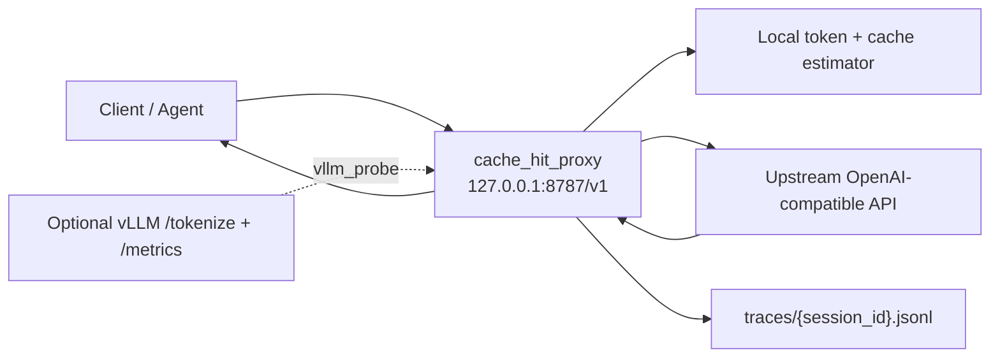

# Cache Hit Proxy

<p align="center">
  <strong>OpenAI-compatible LLM Prompt Cache 观测、估算与对照代理</strong>
</p>

<p align="center">
  
  
  
  
  
</p>

`cache_hit_proxy` 是一个本地 HTTP 代理，用于观测 `POST /v1/chat/completions` 请求的 prompt token、Prompt Cache 命中估计，以及上游模型服务返回的真实 `usage`。

它的目标不是替代模型网关，而是在不改变 OpenAI-compatible 调用习惯的前提下，给开发者一条清晰的诊断链路：本地估算多少 token，供应商或 vLLM 实际报告多少 token，缓存命中是否符合预期，每次请求留下什么可复盘证据。

> 本仓库只发布代理工具本体。不要把个人实验结果、本地服务信息、API key、raw response、trace 数据或私有运行日志提交到公开仓库。

## 适合谁

- 正在调试 OpenAI-compatible LLM API 的开发者。
- 想比较本地 prompt token 估算与供应商 `usage` 返回差异的人。
- 想观测 vLLM Prefix Cache 命中行为的人。
- 想为 agent、多轮对话或长上下文请求建立 cache-hit 诊断 trace 的人。

## 核心能力

| 能力 | 说明 |
| --- | --- |
| 透明代理 | 接收本地 `/v1/chat/completions` 请求，并转发到上游 OpenAI-compatible 服务。 |
| Prompt token 估算 | 使用本地 tokenizer preset 或 vLLM `/tokenize` 估算输入 token。 |
| Prompt Cache 命中估算 | 基于请求历史、block size 和前缀匹配估算可复用缓存 token。 |
| 真实 usage 读取 | 从 JSON 响应、SSE stream event 或 vLLM Prometheus metrics 中读取真实 token/cache 信息。 |
| 多场景模式 | 覆盖普通 chat、OpenClaw agent、pi-ai payload 和 vLLM probe 场景。 |
| JSONL trace | 每次请求写入结构化 trace，方便离线分析、回归对比和问题复盘。 |

## 工作原理



代理在请求转发前生成本地估算，在收到响应后读取真实 usage，并将两者合并写入 trace。默认不保存原始请求正文；只有显式开启 `--raw-request-capture` 时才会记录 raw body。

## 快速开始

### 1. 安装

建议使用 Python 3.12 或更新版本。

```bash
git clone <YOUR_REPOSITORY_URL>
cd <YOUR_REPOSITORY>/cache_hit_proxy
python -m pip install -r requirements.txt
```

检查版本：

```bash
python main.py --version
```

### 2. 准备 tokenizer

如果使用本地 tokenizer preset，先检查 tokenizer 资源：

```bash
python download_tokenizers.py --check-only
```

缺失时再下载：

```bash
python download_tokenizers.py
```

下载脚本只拉取 tokenizer 和 chat template，不下载模型权重。

如果使用 `--tokenizer-preset vllm`，代理会调用 vLLM `/tokenize`，不需要本地 tokenizer 目录。

### 3. 启动通用代理

```bash
python main.py \
  --port 8787 \
  --target-base-url https://YOUR_PROVIDER_BASE_URL \
  --tokenizer-preset deepseek-v4-pro \
  --conversation-mode simple_streaming
```

把客户端配置为：

```text
base_url = http://127.0.0.1:8787/v1
api_key  = 继续使用上游供应商要求的 key
model    = 上游模型名
```

如果上游不是标准的 `{base}/v1/chat/completions` 路径，使用完整 endpoint：

```bash
python main.py \
  --port 8787 \
  --target-chat-url https://YOUR_PROVIDER_FULL_CHAT_COMPLETIONS_URL \
  --tokenizer-preset deepseek-v4-pro \
  --conversation-mode simple_streaming
```

## 运行模式

通过 `--conversation-mode` 选择请求处理方式。

| 模式 | 适用场景 | 关键行为 |
| --- | --- | --- |
| `simple_streaming` | 普通 OpenAI-compatible chat/completions 请求 | 默认通用模式，读取上游 JSON/SSE usage。 |
| `openclaw_agent` | OpenClaw agent 请求 | 使用 raw HTTP body 作为输入 token 来源，并加入多轮缓存估计修正。 |
| `piai_probe` | pi-ai 最终 provider payload 分析 | 读取 `tools`、`thinking`、`reasoning_effort` 和 content blocks。 |
| `vllm_probe` | vLLM Prefix Cache 观测 | 通过 `/tokenize` 估算 token，并从 `/metrics` 读取真实 cache-hit delta。 |

### OpenClaw Agent

```bash
python main.py \
  --port 8787 \
  --target-base-url https://YOUR_PROVIDER_BASE_URL \
  --tokenizer-preset deepseek-v4-pro \
  --block-size 64 \
  --cache-idle-ttl-hours 24 \
  --conversation-mode openclaw_agent \
  --raw-request-capture none
```

默认情况下，内存中的历史请求只按 idle TTL 清理，不按请求数量截断。只有在需要手动限制内存时，才设置 `--max-history-requests`。

### vLLM Probe

标准 vLLM OpenAI-compatible 地址：

```bash
python main.py \
  --port 8787 \
  --target-base-url http://YOUR_VLLM_HOST:8000/v1 \
  --tokenizer-preset vllm \
  --conversation-mode vllm_probe \
  --session-id vllm_probe
```

显式指定 chat、tokenize、metrics：

```bash
python main.py \
  --port 8787 \
  --target-chat-url http://YOUR_VLLM_HOST:8000/v1/chat/completions \
  --vllm-tokenize-url http://YOUR_VLLM_HOST:8000/tokenize \
  --vllm-metrics-url http://YOUR_VLLM_HOST:8000/metrics \
  --tokenizer-preset vllm \
  --conversation-mode vllm_probe
```

使用 `vllm_probe` 时，尽量避免同一个 vLLM 进程上混入无关请求，否则 metrics delta 可能包含其他流量。

## Tokenizer 预设

| Preset | 行为 |
| --- | --- |
| `deepseek-v4-pro` | 使用内置 DeepSeek tokenizer 和 prompt renderer。 |
| `glm-5.1` | 使用本地 GLM tokenizer 和官方 chat template。 |
| `qwen3-coder-plus` | 使用本地 Qwen3-Coder tokenizer 和官方 chat template。 |
| `kimi-k2.6` | 使用本地 Kimi tokenizer 和官方 chat template。 |
| `doubao-seed-2-0-code-preview-260215` / `volcanoengine` | fallback 到 DeepSeek tokenizer，可本地估算，但预期会有误差。 |
| `vllm` | 调用正在运行的 vLLM server `/tokenize`，适合泛用 vLLM OpenAI-compatible 服务。 |

默认目录规则：

- DeepSeek 与 Doubao fallback 使用 `./deepseek_tokenizer`。
- GLM、Qwen、Kimi 使用 `./tokenizers/<preset>`。
- `vllm` 默认由 `--target-base-url` 推导 `/tokenize`，也可以通过 `--vllm-tokenize-url` 显式指定。

如需指定其他 tokenizer 目录：

```bash
--tokenizer-dir /path/to/tokenizer
```

## CLI 参数

| 参数 | 说明 |
| --- | --- |
| `--version` | 输出当前工具版本。 |
| `--port` | 本地代理端口，默认 `8787`。 |
| `--target-base-url` | 上游 API base URL，会自动拼接 `/v1/chat/completions`。 |
| `--target-chat-url` | 上游完整 chat completions URL，优先级高于 `--target-base-url`。 |
| `--tokenizer-preset` | tokenizer preset，默认 `deepseek-v4-pro`。 |
| `--tokenizer-dir` | 自定义本地 tokenizer 目录。 |
| `--conversation-mode` | 请求处理模式，默认 `simple_streaming`。 |
| `--block-size` | 缓存估算 block size。非 vLLM 模式默认 `64`。 |
| `--cache-idle-ttl-hours` | 历史请求 idle TTL，默认 `24` 小时。 |
| `--max-history-requests` | 内存历史请求数量上限，`0` 表示不按数量限制。 |
| `--session-id` | trace session id，未指定时自动生成。 |
| `--raw-request-capture` | raw request 记录模式：`none`、`utf8`、`base64`。默认 `none`。 |
| `--vllm-tokenize-url` | vLLM `/tokenize` URL。 |
| `--vllm-metrics-url` | vLLM `/metrics` URL。 |

完整参数以 `python main.py --help` 为准。

## Trace 输出

默认输出路径：

```text
traces/{session_id}.jsonl
```

常用字段：

| 字段 | 含义 |
| --- | --- |
| `conversation_mode` | 当前请求使用的代理模式。 |
| `tokenizer_preset` | 当前请求使用的 tokenizer preset。 |
| `predicted_input_tokens` | 本地估算输入 token。 |
| `actual_input_tokens` | 上游或 vLLM 观测到的真实输入 token。 |
| `estimated_cached_tokens` | 本地估算缓存命中 token。 |
| `actual_cached_tokens` | 上游 usage 或 vLLM metrics 中的真实缓存命中 token。 |
| `difference_tokens` | `actual_cached_tokens - estimated_cached_tokens`。 |
| `status` | 本次估算状态，例如正常、未知、上游错误或明显高估。 |
| `usage_source` | usage 来源，例如上游响应或 vLLM metrics delta。 |

Trace 可能包含 prompt、模型名、usage 和请求元数据。默认不要提交 trace；只有在脱敏后才考虑分享。

## 项目结构

```text
cache_hit_proxy/
├── main.py                    # CLI、FastAPI app、请求转发和 trace 写入入口
├── request_recorder.py        # 请求规范化、token 记录、历史管理
├── cache_estimator.py         # Prompt Cache 命中估算逻辑
├── tokenizer_adapters.py      # tokenizer preset、HF tokenizer、vLLM /tokenize adapter
├── usage_reader.py            # JSON/SSE usage 解析
├── vllm_metrics.py            # vLLM Prometheus metrics 解析与 delta 计算
├── download_tokenizers.py     # tokenizer-only 资源下载/检查
├── validate_tokenizers.py     # 本地估算与 provider usage 对照验证
├── deepseek_tokenizer/        # 内置 DeepSeek tokenizer 轻量资源
├── tests/                     # 单元测试
├── traces/.gitkeep            # trace 目录占位，真实 trace 不提交
├── AGENTS.md                  # 给代码 Agent 的快速理解和使用指南
└── README.md
```

## 给 Agent 的文档

如果后续有 Agent 读取这个项目，请先读：

```text
AGENTS.md
```

它包含项目心智模型、入口文件、运行方式、模式选择、tokenizer 选择、测试策略和安全边界，适合让 Agent 快速接手。

## 测试

```bash
python -m pytest
```

当前测试覆盖 tokenizer adapter 行为和 vLLM metrics 解析逻辑。

如果要调用真实 provider 做 tokenizer 验证，需要用户显式提供凭据并确认会消耗 API quota：

```bash
python validate_tokenizers.py --sample short
python validate_tokenizers.py --sample long-1000
```

## 安全与提交边界

不要提交：

- API key、`.env`、本地配置、认证文件。
- `traces/*.jsonl`、raw request、raw response、日志和 provider 实验结果。
- `node_modules/`、`__pycache__/`、`.pytest_cache/`、下载的 tokenizer 大目录。
- 本地机器路径、SSH alias、隧道端口、私有模型服务信息。

公开仓库应只包含代理源码、测试、文档、必要的轻量 tokenizer 资源和空 trace 目录占位文件。

## 发布状态

当前版本：`0.2.0`

当前状态是 research preview，API 和 trace 字段仍可能随实验需求调整。正式发布前建议补充：

- 许可证文件 `LICENSE`。
- 固定依赖版本或 lock file。
- 更完整的端到端示例和 CI。

## English Summary

`cache_hit_proxy` is a local OpenAI-compatible proxy for observing prompt tokens, prompt-cache estimates, and provider-reported usage on `POST /v1/chat/completions`.

Quick start:

```bash
python -m pip install -r requirements.txt
python main.py \
  --port 8787 \
  --target-base-url https://YOUR_PROVIDER_BASE_URL \
  --tokenizer-preset deepseek-v4-pro \
  --conversation-mode simple_streaming
```

Point your client to:

```text
http://127.0.0.1:8787/v1
```

For automation agents, see [`AGENTS.md`](AGENTS.md).
